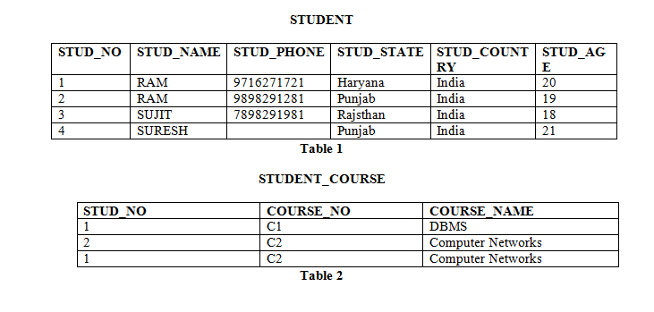

#	Veille SQL

1. ## Les critères de mesure de qualité des données.

    Ces six critères sont la pertinence, l’exactitude, l’actualité, l’accessibilité, l’intelligibilité et la cohérence.

    Les trois premiers critères sont génériques.

    La pertinence d’une enquête, d’une étude, d’un dispositif, est son utilité ; elle dépend de la connaissance et de la maîtrise du domaine du prestataire ou propriétaire des données, et des bonnes connaissances et applications des traitements et usages)
    L’exactitude est synonyme de précision : les paramètres pouvant influer son le plan d’échantillonnage, son respect, la clarté et la bonne compréhension des questions dans le cas où ceci a un sens (tous les recueils de données ne viennent pas de réponses à des « questions »), la couverture du dispositif (toute la population à analyser est-elle observée, observable ?), et la granularité ou la finesse de l’observation.

    L’actualité, que nous pouvons aussi appeler la récence, est à l’évidence le temps qui s’écoule entre la collecte des données et la parution des résultats. Mais de façon plus générale, ce terme est adapté au temps qui s’écoule entre le moment observé et le moment du recueil lui-même.

    Les trois autres critères de Brackstone sont plus « techniques ».
    L’accessibilité concerne le mode de restitution, de mise à disposition, de présentation. La visualisation en fait partie.
    L’intelligibilité porte sur la documentation de la méthodologie employée, sa clarté, sa compréhension par des utilisateurs non-spécialistes.

    Enfin, la cohérence consiste à la validation interne de la base de données, mais aussi et surtout à la comparabilité des données et des résultats à des connaissances antérieures, en particulier si le dispositif est répété dans le temps, comme c’est le cas des panels.[1]

2. ## Systèmes de Gestion de Bases de Données
    Un système de gestion de base de données (abr. SGBD) est un logiciel système servant à stocker, à manipuler ou gérer, et à partager des données dans une base de données, en garantissant la qualité, la pérennité et la confidentialité des informations, tout en cachant la complexité des opérations.

    Un SGBD (en anglais DBMS pour database management system) permet d'inscrire, de retrouver, de modifier, de trier, de transformer ou d'imprimer les informations de la base de données. Il permet d'effectuer des comptes rendus des informations enregistrées et comporte des mécanismes pour assurer la cohérence des informations, éviter des pertes d'informations dues à des pannes, assurer la confidentialité et permettre son utilisation par d'autres logiciels. Selon le modèle, le SGBD peut comporter une simple interface graphique jusqu'à des langages de programmation sophistiqués.[2]

    Les outils que nous utilisons tous au quotidien nécessitent des SGBD en coulisse. Cela comprend les guichets automatiques bancaires, les systèmes de réservation de vols, les systèmes d'inventaire au détail et les catalogues de bibliothèques, par exemple.

3. ## Une base de données relationnelle et non relationnelle.

    ### Une base de données relationnelle
     est un type de base de données où les données sont liées à d'autres informations au sein des bases de données. Les bases de données relationnelles sont composées d’un ensemble de tables qui peuvent être accessibles et reconstruites de différentes manières, sans qu'il soit nécessaire de réarranger ces tables de quelque façon que ce soit. Le langage de requête structuré (SQL) est l’interface standard pour une base de données relationnelle. Les instructions SQL sont utilisées à la fois pour interroger de façon interactive les données contenues dans la base de données relationnelle et pour collecter les données dans le cadre de rapports.[3]

    ### Une base de données non relationnelle
    Dans un contexte de quantité croissante de données, la base de données relationnelle n’est pas assez efficace. A contrario, la base de données non relationnelle permet de stocker des données volumineuses. Celles-ci peuvent être regroupées sur plusieurs machines afin de réduire les coûts de maintenance.

    Les bases de données NoSQL peuvent être de différents types :

    - Bases de documents : Les données dynamiques y sont stockées, au format JavaScript Object Notation (JSON). Par exemple : CouchDB, Mongo
    - Base de données de colonnes : Elle est utile pour analyser les données. Par exemple : Apache Cassandra
    - Bases de données en cache : Les données sont stockées sur le disque ou le cache. Par exemple : Memcache
    - Bases de données graphiques : Elle est composée de nœuds et créé des relations en utilisant des arêtes. Par exemple. Oracle NoSQL, Neo4J.

    ## Finalement, la différence qui existe entre une base de données relationnelle et une base de données non relationnelle
    Est la façon de stocker. L’une stocke les données dans des tables tandis que l’autre les stockent au format clé-valeur de manière à stocker davantage en termes de quantité. Si le NoSQL répond à la problématique actuelle du Big Data, il ne replace pas pour autant la base de données relationnel mais plutôt la complète.[4]

4. ## Clé étrangère et clé primaire.
    ### Clé primaire :
    Une clé primaire est utilisée pour garantir que les données de la colonne spécifique sont uniques. C’est une colonne qui ne peut pas avoir de valeurs NULL. Il s’agit soit d’une colonne de table existante, soit d’une colonne spécifiquement générée par la base de données selon une séquence définie.

    Exemple : Reportez-vous à la figure –
    STUD_NO, ainsi que STUD_PHONE, sont des clés candidates pour la relation STUDENT mais STUD_NO peut être choisie comme clé primaire (une seule parmi plusieurs clés candidates)
    ### Clé étrangère :
    Une clé étrangère est une colonne ou un groupe de colonnes dans une table de base de données relationnelle qui fournit un lien entre les données de deux tables. C’est une colonne (ou des colonnes) qui référence une colonne (le plus souvent la clé primaire) d’une autre table.

    Exemple : Reportez-vous à la figure –
    STUD_NO dans STUDENT_COURSE est une clé étrangère à STUD_NO dans la relation STUDENT.

    ### Chiffre:
    
    
    
    
    ..[5]

    

3. ## Bibliographie 
	- #### [1] [Système de gestion de base de données](https://fr.wikipedia.org/wiki/Syst%C3%A8me_de_gestion_de_base_de_donn%C3%A9es) Wikipedia 29/11/2022

    - #### [2] [Les critères de mesure de qualité des données](https://variances.eu/?p=1864#:~:text=Ces%20six%20crit%C3%A8res%20sont%20la,l'intelligibilit%C3%A9%20et%20la%20coh%C3%A9rence) Variances Education 30/11/2022

    - #### [3] [Une base de données relationnelle](https://www.oracle.com/fr/database/base-de-donnees-relationnelle-definition.html) Oracle 30/11/2002

    - #### [4] [Une base de données relationnelle et non relationnelle la différence entre les deux ](https://www.oracle.com/fr/database/base-donnees-relationnelle-difference-non-relationnelle.html) Oracle 30/11/2002
    - #### [5] [Clé étrangère et clé primaire ](https://www.oracle.com/fr/database/base-de-donnees-relationnelle-definition.html) Oracle 30/11/2002

